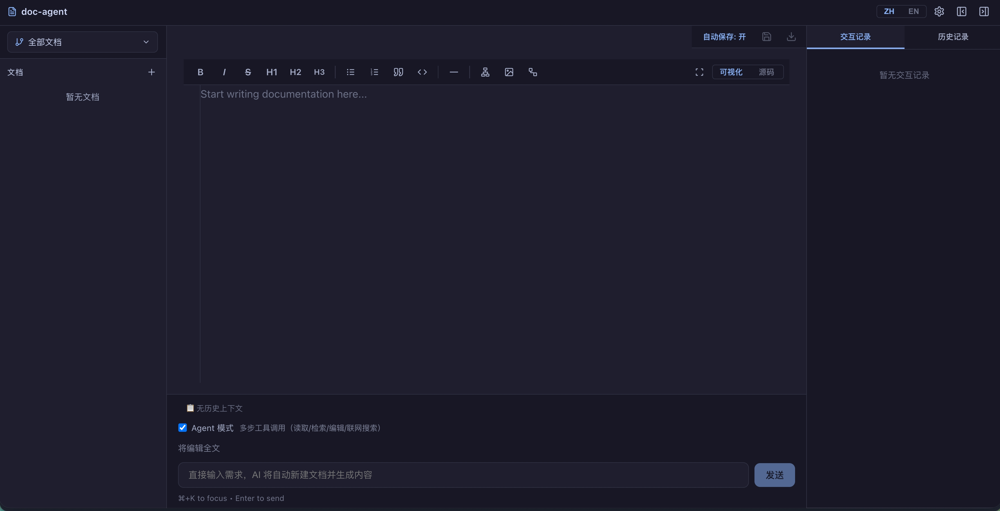
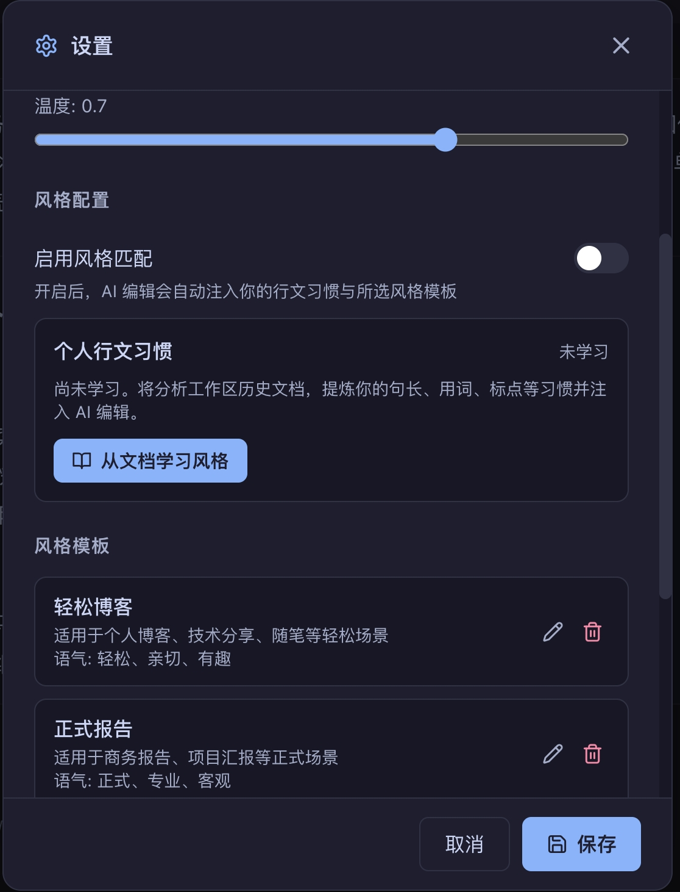
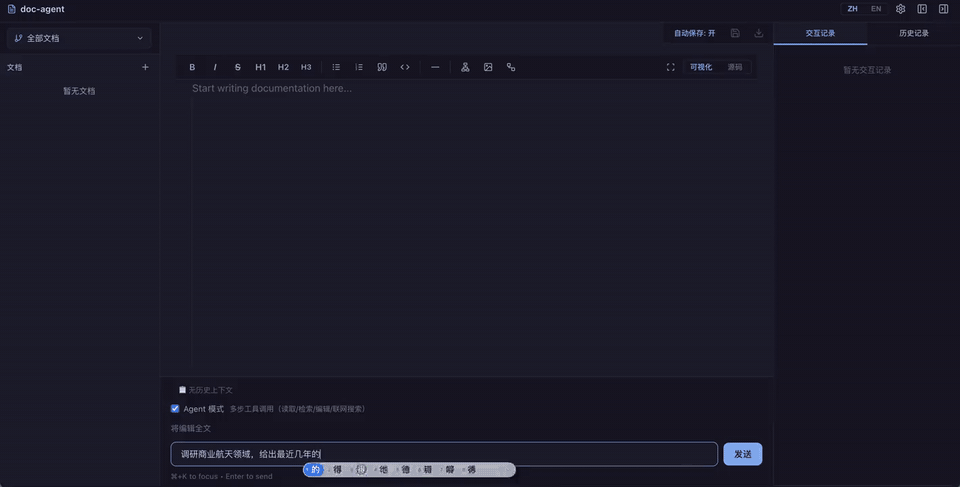

# Doc-Agent

中文文档 | [English](README_EN.md)

AI 驱动的文档编辑助手，提供类 Cursor 的智能编辑体验。

## 功能特性

- **AI 辅助文档编辑** — 自然语言指令驱动，智能理解编辑意图
- **从零生成文档** — 无需先建文档，直接输入需求，自动新建文档并由 AI 撰写内容
- **Markdown 源码编辑** — 支持 Visual/Source 双模式切换，源码模式直接编辑 Markdown
- **版本管理 + 多分支** — 支持多交付对象，独立分支并行编辑
- **文档-分支解耦视图** — 文档作为一等实体，分支作为筛选条件，跨分支统一视图
- **个人行文风格学习** — 自动学习并复用你的写作习惯
- **文风模板管理** — 支持导入、创建、编辑和应用文风模板，AI 编辑时可选择风格
- **参考文库风格模板** — 内置多种文档风格模板，一键切换
- **实时 Diff 对比预览** — 编辑前后实时对比，改动一目了然
- **文档级上下文管理** — 交互记录按文档+分支关联，AI 编辑时自动注入历史对话上下文
- **交互记录持久化** — 全部 AI 交互记录持久化存储，支持按文档/分支筛选查看
- **文档导出** — 支持导出为 .md / .txt 格式
- **中英文国际化** — 界面支持中英文一键切换，自动检测浏览器语言偏好
- **云端/本地模型自由切换** — 支持 Anthropic、OpenAI（及兼容端点）、Ollama 等多种后端
- **跨平台** — 支持 Mac / Linux / Windows

## 界面预览

| 主界面（无文档直接输入需求） | 设置页：风格学习与模板 |
|------------------------------|------------------------|
|  |  |

## 演示录屏

输入需求 → 自动新建文档 → Agent 联网搜索 + 撰写全文（37s）：



> 📼 [查看高清 MP4 版本](docs/images/demo.mp4)
>
> 📸 待补截图：AI 编辑 Diff 预览、Agent 工具调用时间线、多分支视图（放入 `docs/images/` 并在上方表格补一行即可）。

## 快速开始

```bash
# 1. 克隆并安装
git clone https://github.com/<your-username>/doc-agent.git
cd doc-agent
pip install -e .

# 2. 初始化配置
cp config.example.yaml config.yaml
# 编辑 config.yaml，设置模型提供方与 API key

# 3. 启动服务
doc-agent serve
```

启动后浏览器会自动打开编辑器界面（默认 `http://127.0.0.1:3966`）。

## 配置说明

配置加载顺序：`./config.yaml`（当前目录）→ `~/.doc-agent/config.yaml`。主要配置项：

| 配置段 | 说明 |
|--------|------|
| `server.host` / `server.port` | 服务绑定地址与端口（默认 127.0.0.1:3966） |
| `model.provider` | `cloud` / `local` |
| `model.cloud.service` | `anthropic` / `openai`（可用 `base_url` 接入 OpenAI 兼容端点） |
| `model.cloud.model` | 模型名称 |
| `model.cloud.api_key_env` | 存放 API Key 的环境变量名 |
| `model.local.endpoint` | Ollama 端点（默认 http://localhost:11434） |
| `workspace.path` | 文档工作区根目录 |
| `agent.max_steps` | Agent 单轮最大工具调用步数（默认 10） |
| `agent.enable_web_search` | 是否启用联网搜索工具（默认 true） |
| `agent.search.provider` | `duckduckgo`（免 key）/ `tavily` / `brave` / `bocha` |

> ⚠️ **请勿提交 API Key**。`config.yaml` 已默认加入 .gitignore，建议通过环境变量注入密钥。

## CLI 命令

```bash
doc-agent serve              # 启动服务（主入口）
doc-agent init [--path DIR]  # 初始化工作区
doc-agent config set KEY VAL # 设置配置项
doc-agent config get [KEY]   # 查看配置
doc-agent config show        # 显示完整配置
doc-agent --version          # 版本信息
```

## 开发者指南

```bash
# 后端
pip install -e ".[dev]"
pytest tests/ -v
python3 -m uvicorn doc_agent.server:app --host 127.0.0.1 --port 3966

# 前端
cd frontend && npm install
npx vite --port 5173 --strictPort
```

前端开发服务器默认运行在 `http://localhost:5173`，会自动代理 API 请求到后端。

## 技术栈

| 层 | 技术 |
|----|------|
| 后端框架 | FastAPI + Uvicorn |
| AI 接入 | Anthropic / OpenAI / Ollama |
| 版本控制 | GitPython |
| 前端框架 | React 18 + TypeScript |
| 状态管理 | useReducer + Context API |
| 富文本编辑 | Tiptap + tiptap-markdown |
| 国际化 | React Context + localStorage |
| 构建工具 | Vite |
| 包管理 | pip (setuptools) / npm |

## License

MIT
